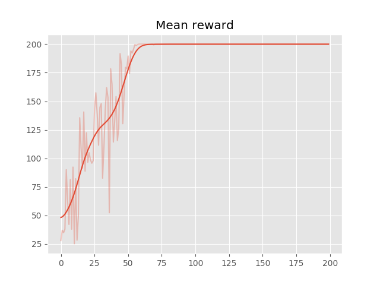
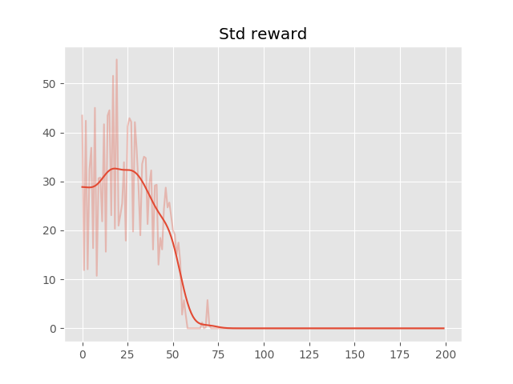
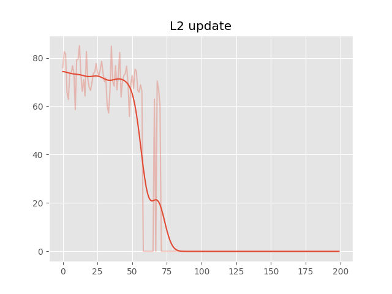

# Evolution Strategies CartPole

A starter example for solving reinforcement learning environment using evolution strategies
The following example implements **mirrored sampling** which increases stability 

### Some results: 

